# Funcións

Ata o de agora estabamos acostumados a facer duas cousas coas funcións:

1. Definir unha función.
2. Usar (chamar, executar ou invocar, todas son sinónimos) unha función.

## Índice

- [Funcións](#funcións)
  - [Índice](#Índice)
  - [1.1 Definición dunha función](#11-definición-dunha-función)
  - [1.2 Invocación dunha función](#12-invocación-dunha-función)
  - [1.3 Anatomía dunha función (definición e invocación)](#13-anatomía-dunha-función-definición-e-invocación)
  - [1.4 Clasificación das funcións](#14-clasificación-das-funcións)
  - [1.5 `undefined` e `return`](#15-undefined-e-return)
  - [1.6 Efectos secundarios nas funcións](#16-efectos-secundarios-nas-funcións)
  - [1.7 Exemplo](#17-exemplo)
  - [1.8 `map`, `filter` e `reduce`](#18-map-filter-e-reduce)
    - [1.8.1 `<array>.map(function)`](#181-arraymapfunction)
    - [1.8.2 `<array>.filter(function)`](#182-arrayfilterfunction)
    - [1.8.3 `<array>.reduce(function)`](#183-arrayreducefunction)
  - [1.9 Funcións anónimas, Arrow Functions e Lambda Functions](#19-funcións-anónimas-arrow-functions-e-lambda-functions)
    - [1.9.1 Inconsistencias](#191-inconsistencias)
    - [1.9.2 `return` implícito](#192-return-implícito)
  - [INTERLUDIO: Interpolación de Strings](#interludio-interpolación-de-strings)
  - [INTERLUDIO: Emojis e Strings](#interludio-emojis-e-strings)
  - [1.10 ¿Por qué existen os parámetros?](#110-por-qué-existen-os-parámetros)
    - [1.10.1 O problema](#1101-o-problema)
    - [1.10.2 A solución](#1102-a-solución)
    - [1.10.3 Conclusión](#1103-conclusión)
  - [1.11 O caso de `"hello".toUpperCase()`](#111-o-caso-de-hellotouppercase)
    - [1.11.1 O primeiro problema](#1111-o-primeiro-problema)
    - [1.11.2 O segundo problema](#1112-o-segundo-problema)
    - [1.11.3 A solución](#1113-a-solución)
    - [1.11.4 Conclusion](#1114-conclusion)
    - [1.11.5 Exercicio](#1115-exercicio)

## 1.1 Definición dunha función

```js
function add1(x) {
  return x + 1;
}
```

## 1.2 Invocación dunha función

```js
add1(9); // Devolve un 10
add1(4); // Devolve un 5
```

## 1.3 Anatomía dunha función (definición e invocación)

Imos poñerlle nome a cada unha das partes dunha función

```js
function magic(x, y, z) {
  return x + y - z;
}

magic(20, 12, 2); // Devolve 30
```

- `function` indica que estamos a definir unha función.
- `magic` é o nome que escollemos para a función.
- `x` é o primerio parámetro da función.
- `20` é o primeiro argumento da invocación da función (vai acabar substituindo a `x`).
- `y` é o segundo parámetro da función.
- `12` é o segundo argumento da invocación da función (vai acabar substituindo a `y`).
- `z` é o terceiro parámetro da función.
- `2` é o terceiro argumento da invocación da función (vai acabar substituindo a `z`).
- `(x, y, z)` é a lista de parámetros da función. A **orde** dos parámetros **importa**.
- `(20, 12, 2)`é a lista de argumentos da invocación da función.
- `{ return x + y - z; }` é o corpo (_body_) da función.
- `x + y - z` é o valor de retorno (está despois de `return`) da función.

## 1.4 Clasificación das funcións

Dende o punto de vista que estamos a defender na clase, podemos ver as funcións (unha vez definidas) coma caixas negras tal que

```
      -----------
      |         |
 IN → | FUNCIÓN | → OUT
      |         |
      -----------
```

É dicir, só nos interesan as entradas (**IN**) e saidas (**OUT**). Por exemplo, `magic` ten

- 3 entradas `(x, y, z)`
- 1 saida, o resultado de `x + y - z` que é un número e podemos chamarlle `q`

```
      -----------
  x → |         |
  y → | FUNCIÓN | → q (= x + y - z)
  z → |         |
      -----------
```

## 1.5 `undefined` e `return`

> ¿Que acontece cando facemos un `console.log('Ola')`?

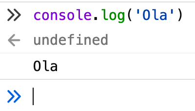

> ¿Qué é iso de `undefined`?

Vexamos outro exemplo

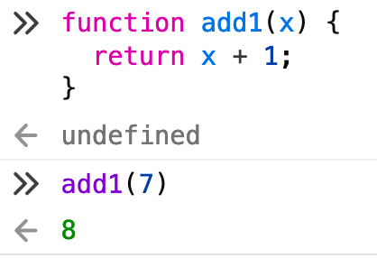

Cando tras a flecha cara a esquerda aparece `undefined`, significa que a función invocada non devolve nada...


É dicir:

- `console.log` non ten `return`.
- A definición dunha función con `function` non ten `return`.
- `add1` sí ten `return` (e devolve un `8`)

Podemos definir funcións que non devolven nada. Por exemplo (fixádevos como **non usamos `return`**)

```js
function noReturn(x) {
  x + 100;
}

noReturn(4);
```

Esto é o que acontece

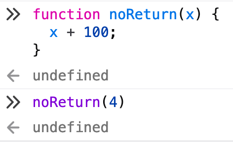

> Pero entón, ¿cómo pode ser que `console.log` non devolva nada pero ainda así vexamos o resultado?

A resposta... os efectos secundarios

## 1.6 Efectos secundarios nas funcións

Consideremos a seguinte función con moitos efectos secundarios (3, en concreto)

```js
function efectosSecundarios(x) {
  console.log(x + 100);
  console.log('Ola!!!');
  console.log('Aquí');
  return x + 50;
}

efectosSecundarios(20);
```

Fixádevos qué acontece

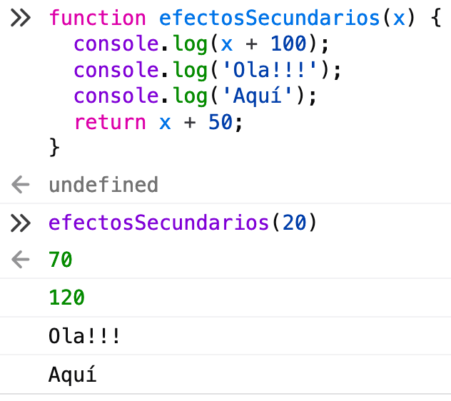

Debemos actualizar o concepto das caixas negras

```
      -----------
      |         |
 IN → | FUNCIÓN | → OUT
      |         |
      -----------
           ↓
        Efectos
      Secundarios

```

## 1.7 Exemplo

Podemos levar esta idea ainda máis alá. Considerade a seguinte función

```js
function efectosSecundariosAndNoReturn(x) {
  console.log(x + 100);
  console.log('Ola!!!');
  console.log('Aquí');
  x + 20;    // OLLO. NON HAI return
}

efectosSecundarios(50);
```

Fixémonos en qué acontece

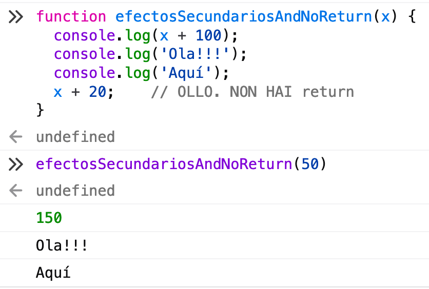

Efectivamente non hai return (mirade o `undefined` por riba do `150`) e temos 3 efectos secundarios.

Poderiamos dicir que `efectosSecundariosAndNoReturn` ten

- 1 entrada `x`
- 0 saidas (no `return`, daí o `undefined`)
- 3 efectos secundarios:
	- `150`
	- `Ola!!!`
	- `Aquí`

## 1.8 `map`, `filter` e `reduce`

Xa sabemos usar `map`, `filter` e máis `reduce`. Recordemos

```js
function add1(x) {
  return x + 1;
}

[10, 20, 30].map(add1);

function greaterThan15(x) {
  return x > 15;
}

[10, 20, 30].filter(greaterThan15);

function minus(acc, x) {
  return acc - x;
}

[10, 20, 30].reduce(minus);
```

### 1.8.1 `<array>.map(function)`

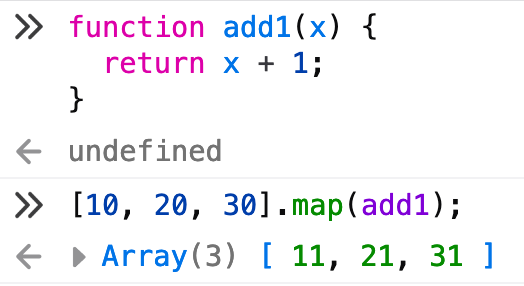

> ¿Qué tipo de función agarda `map` como argumento?

Unha como `add1`. É dicir:

- 1 entrada (`x`)
- 1 saida (o resultado de facer `x + 1`)

Se `map` recibe como argumento unha función con características diferentes non vai funcionar. Por exemplo se recibe unha función con 3 entradas, falla.

### 1.8.2 `<array>.filter(function)`

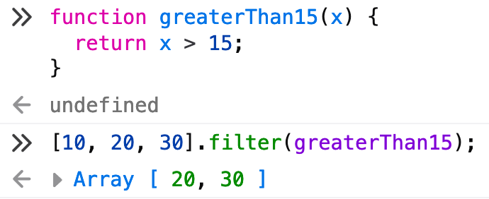

> ¿Qué tipo de función agarda `filter` como argumento?

Unha como `greaterThan15`. É dicir:

- 1 entrada (`x`)
- 1 saida (o resultado de facer `x > 15`).

Pero neste caso ademais a saida debe ser ou `true` ou `false`. A este tipo de funcións chamámolas **predicados**.

Se `filter` recibe como argumento unha función con características diferentes non vai funcionar. Por exemplo se recibe unha función con 3 entradas falla ou se recibe unha función que non devolve `true` ou `false`.

### 1.8.3 `<array>.reduce(function)`

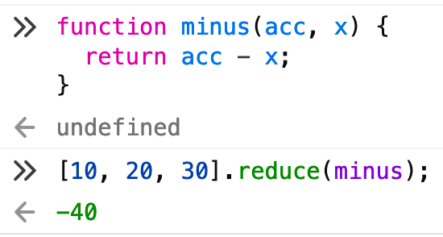

> ¿Qué tipo de función agarda `reduce` como argumento?

Unha como `minus`. É dicir:

- 2 entradas (`acc`, `x`)
- 1 saida (o resultado de facer `acc - x`).

Neste caso preferimos poñer un nome máis descritivo aos parámetros da función `minus`. En lugar de `x`e `y` poñemos `acc` (diminutivo de `accumulator`) e `x` porque cando lla pasamos a `reduce` fai o seguinte:

1. `acc` toma o valor do primeiro número do array (`acc = 10`) e `x` o do segundo (`x = 20`).
2. executamos o `return` (`acc - x`) obtendo o valor `-10` (`10 - 20 = -10`). Este `-10` vai ser o valor do próximo `acc`.
3. `acc` toma o valor do último `return` (`acc = -10`) e `x` o do seguinte valor do array (`x = 30`).
4. executamos o `return` (`acc - x`) obtendo o valor `-40` (`-10 - 30 = -40`). Este `-40` sería o valor do próximo `acc` pero como xa baleiramos o array pasa a ser o valor resultado final de `reduce`.

As funcións como `minus`, **as veces**, reciben o nome de **reducers** ou **reductores**.

Se `reduce` recibe como argumento unha función con características diferentes non vai funcionar. Por exemplo se recibe unha función con 3 entradas ou con 1 entrada falla en ámbolos casos.

## 1.9 Funcións anónimas, Arrow Functions e Lambda Functions

Podemos definir **funcións anónimas** usando outra notación. Consideremos os exemplos de `map`, `filter` e `reduce` anteriores como punto de partida. O que aparece a continuación sería equivalente

```js
[10, 20, 30].map(num => num + 1);
[10, 20, 30].filter(num => num > 15);
[10, 20, 30].reduce((acc, num) => acc - num);
```

A proba

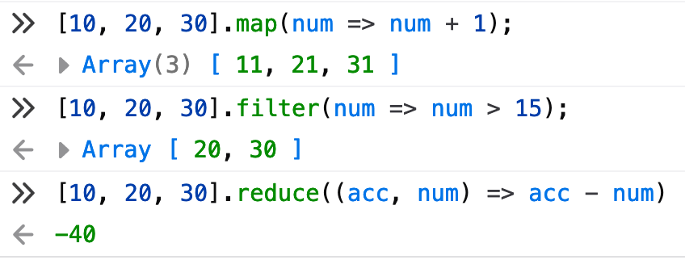

Agora resulta moito menos tedioso encadear operacións

```js
[10, 20, 30, 40, 50, 60, 70, 80]
  .map(num => num + 1)
  .filter(num => num > 15)
  .reduce((acc, num) => acc - num);
```

O resultado

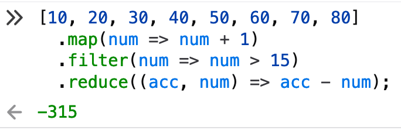

### 1.9.1 Inconsistencias

As Arrow Functions teñen algunha inconsistencia ao respecto da notación

```js
// 0 parámetro
() => 27;  // ✅
   => 27;  // ❌

// 1 parámetro
(x) => x + 10; // ✅
x   => x + 10; // ✅

// 2 ou máis parámetros
(x, y, z) => x + y - z;  // ✅
x, y, z   => x + y - z;  // ❌
```

### 1.9.2 `return` implícito

As Arrow Functions levan un `return` implícito, é dicir as duas funcións que veñen a continuación son equivalentes

```js
(x, y, z) => x + y - z;
(x, y, z) => return x + y - z;
```

## INTERLUDIO: Interpolación de Strings

> Cómo podemos facer para intercalar partes variables nun texto ou String?

Moi sinxelo.

1. Usamos `` para facer o String.
2. Usamos `${}` para encapsular o que queremos intercalar

```js
function useMe(text) {
  return `insert 👉 ${text} 👈`
}

useMe("one two three");
useMe("four five six");
```

A proba

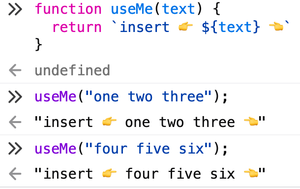

## INTERLUDIO: Emojis e Strings

Os emojis son Strings (texto). A proba... Mirade 👆.

## 1.10 ¿Por qué existen os parámetros?

### 1.10.1 O problema

Supoñamos que queremos facer unha función que me diga ola. Poderiamos pensar en facer algo coma

```js
function sayHiToDavid() {
  return "Hello David 👽👾🤖";
}
```

de xeito que poidamos invocala tal que así

```js
sayHiToDavid();
```

Imos ver que acontece

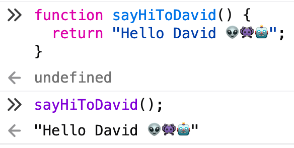

Funciona!!! 👽

O problema é que se queremos saudar a alguén que non sexa David temos que definir outra función diferente. Por exemplo

```js
function sayHiToYou() {
  return "Hello You 👽👾🤖";
}

sayHiToYou();
```

E poderiamos seguir así ata o infinito definindo e usando unha chea de funcións moi semellantes.

```js
function sayHiToInsertNameHere() {
  return "Hello insertNameHere 👽👾🤖";
}
```

A estas alturas xa vemos o problema. Somos moi concretos. Precisamos ser mais abstractos, que o nome da persoa que queremos saudar poida cambiar.... **ENTER PARAMETERS!** 🐉🐉🐉

### 1.10.2 A solución

En vez de facer unha chea de función chamadas `sayHiToDavid`, `sayHiToYou`, `sayHiToKim`, `sayHiToSetsuko` imos definir unha soa función xenérica que nos permita especificar o nome a través dun parámetro

```js
function sayHiTo(name) {
  return `Hello ${name} 👽👾🤖`;
}
```

e agora podemos invocala con moitos nomes diferentes sen facer funcións novas

```js
sayHiTo("David");
sayHiTo("You");
sayHiTo("Kim");
sayHiTo("Setsuko");
```

Comprobamos

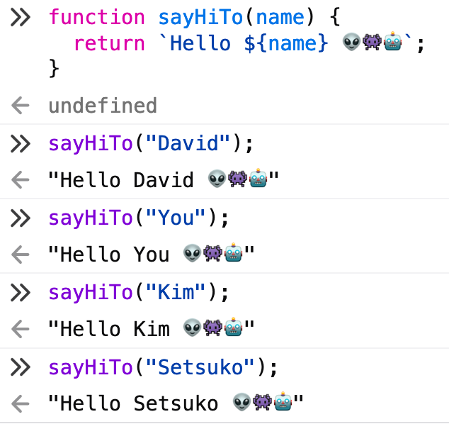

### 1.10.3 Conclusión

Os **parámetros** (`name`) / **argumentos** (`David`, `You`, `Kim`, `Setsuko`) permítennos _encapsular_ as cousas que mudan. Dalgún xeito poderiamos dicir que unha función só debe usar os datos que se lle pasan a través dos parámetros...

Pero entón... qué acontece con `"hello".toUpperCase()`?

## 1.11 O caso de `"hello".toUpperCase()`

### 1.11.1 O primeiro problema

A función `toUpperCase()` permite poñer en maiúsculas un texto (String)... pero funciona dun xeito raro, xa que o texto non vai como parámetro. Vexamos

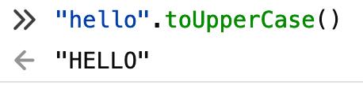

Porén, `toUpperCase("hello")` non funciona...

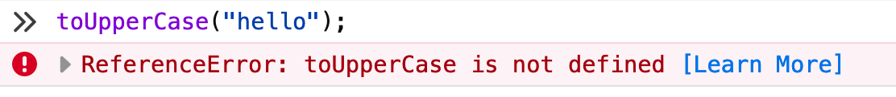

Non imos explicar neste momento que está a acontecer... xa que obligaríanos a falar dos **obxectos** e xa o faremos máis adiante... Pero ten que ver con onde se almacenan as funcións que nos da JavaScript xa feitas.

### 1.11.2 O segundo problema

Imos tentar usar `toUpperCase()` cun `<array de textos>.map` a ver que acontece

```js
["hello", "hallo", "hola", "ola"].map(yell);
```

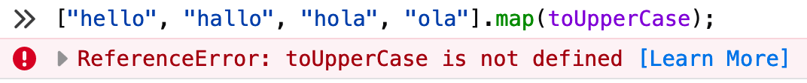

🤔🤔🤔

Analicemos a forma de `<texto>.toUpperCase()`:

- 0 entradas... `()`
- 1 saida, o texto en maiúsculas

Recordemos que `map` quere funcións como `add1(x)`

- 1 entrada
- 1 saida

### 1.11.3 A solución

> Poderiamos crear unha función que grite (`yell`) que sexa compatible con `map` e use dentro `toUpperCase()`?

Claro que podemos

```js
function yell(text) {
  return text.toUpperCase()
}

yell("me");
```

Aquí temos a proba

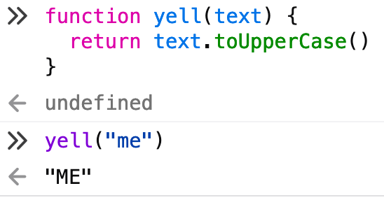

> Pero, funciona con `map`?

```js
["hello", "hallo", "hola", "ola"].map(yell);
```

Comprobemos

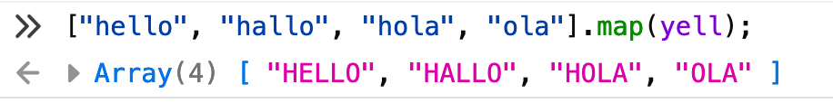

🥳🎉🎊

### 1.11.4 Conclusion

Se queremos usar unha función con `map` do estilo a `<text>.doSomething()` xa sabemos como convertila a `doSomething(text)`  para que funcione.

### 1.11.5 Exercicio

Probade con `"HELLO".toLowerCase()`. Convertídea para que funcione con `map`.

`.toLowerCase` funciona así

```js
"I'M ANGRY!".toLowerCase();
```

Tal e como podemos comprobar 👇

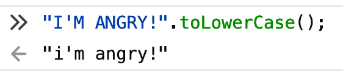

Entón podemos facer `chillTheFunkOut`

```js
function chillTheFunkOut(text) {
  return text.toLowerCase();
}

chillTheFunkOut("I'M ANGRY!");
```

Asegurámonos de que funcione 👇

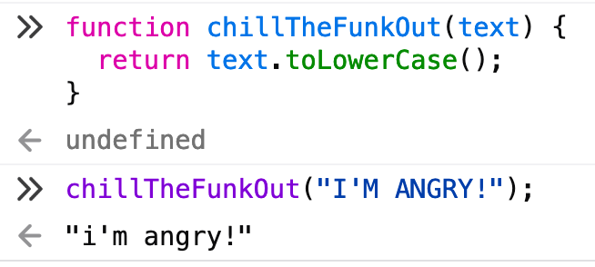

Que efectivamente funciona con `map`

```js
["hello", "hallo", "hola", "ola"].map(chillTheFunkOut);
```

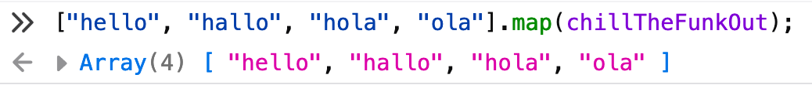

## 1.12 `myMap`, `myFilter`, `myReduce`

### 1.12.1 `<array>.map(function)`

Recordemos como funcionaba `map`

```js
[10, 20, 30, 40].map(x => x + 1);
```

É dicir

```
      -------
      |     |
 fn → | map | → colección
      |     |
      -------
```

Pero `map` fai trampas porque usa unha colección extra. No exemplo de arriba `[10, 20, 30, 40]`.

### 1.12.2 `myMap`

Queremos face unha función `myMap` que siga a seguinte descripción

```
               ---------
  coleccion1 → |       |
               | myMap | → coleccion2
          fn → |       |
               ---------
```

e que internamente use `<array>.map(function)`.

```js
function myMap(coleccion, funcion) {
  return coleccion.map(funcion);
}

myMap(
  [10, 20, 30, 40],
  x => x + 1
);
```

Comprobamos

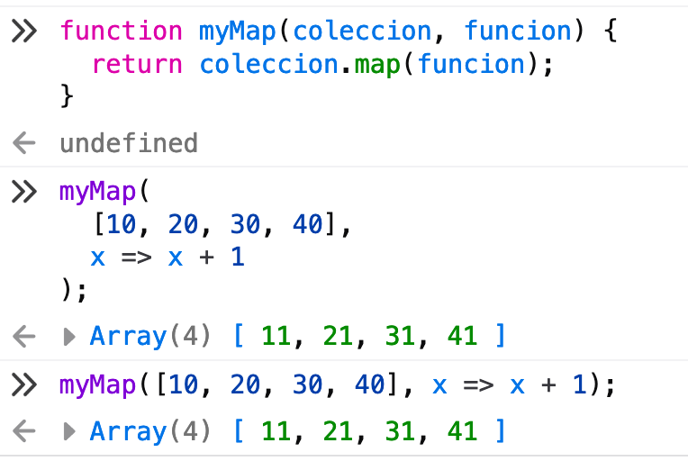

### 1.12.3 `<array>.filter(function)`

Recordemos como funcionaba `filter`

```js
[10, 20, 30, 40].filter(x => x > 15);
```

É dicir

```
      ----------
      |        |
 fn → | filter | → colección
      |        |
      ----------
```

Pero `filter` fai trampas (as mesmas trampas que `map`) porque usa unha colección extra. No exemplo de arriba `[10, 20, 30, 40]`.

### 1.12.4 `myFilter`

Queremos face unha función `myFilter` que siga a seguinte descripción

```
               ------------
  coleccion1 → |          |
               | myFilter | → coleccion2
   predicado → |          |
               ------------
```

e que internamente use `<array>.filter(function)`.

```js
function myFilter(coleccion, predicado) {
  return coleccion.filter(predicado);
}

myFilter(
  [10, 20, 30, 40],
  x => x > 15
);
```

Comprobamos

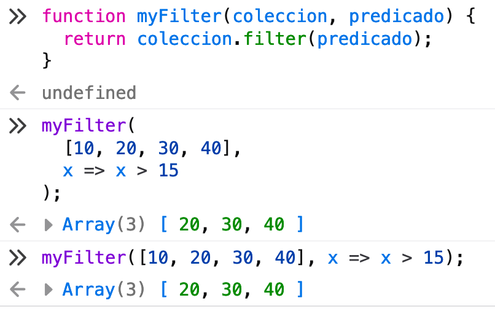

### 1.12.5 `<array>.reduce(function)`

Recordemos como funcionaba `reduce`

```js
[10, 20, 30, 40].reduce((x,y) => x + y);
```

É dicir

```
      ----------
      |        |
 fn → | reduce | → valor
      |        |
      ----------
```

Pero `reduce` fai trampas porque usa unha colección extra. No exemplo de arriba `[10, 20, 30, 40]`.

### 1.12.6 `myReduce`

Queremos face unha función `myReduce` que siga a seguinte descripción

```
               ------------
  coleccion1 → |          |
               | myReduce | → coleccion2
          fn → |          |
               ------------
```

e que internamente use `<array>.reduce(function)`.

```js
function myReduce(coleccion, funcion) {
  return coleccion.reduce(funcion);
}

myReduce(
  [10, 20, 30, 40],
  (x,y) => x + y
);
```

Comprobamos

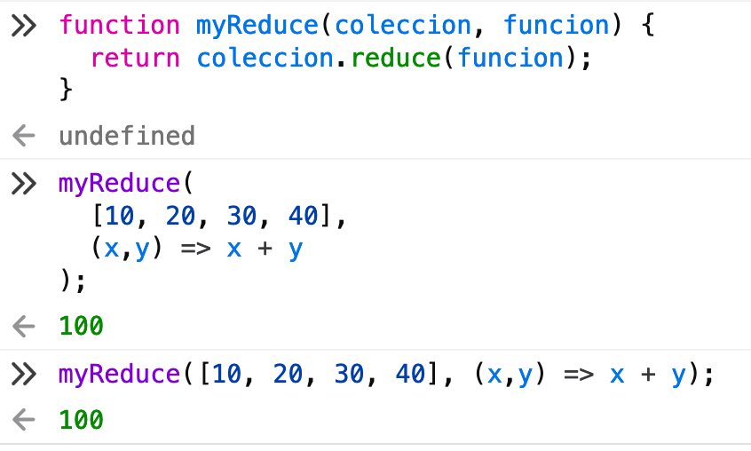
