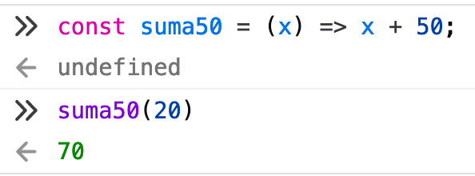
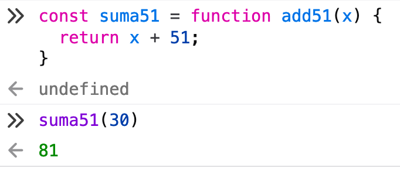
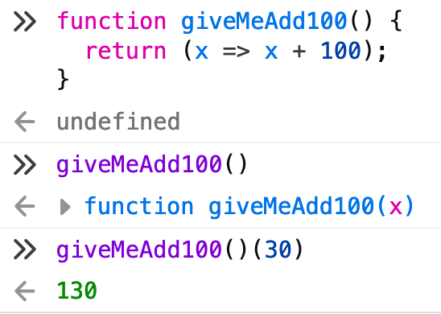
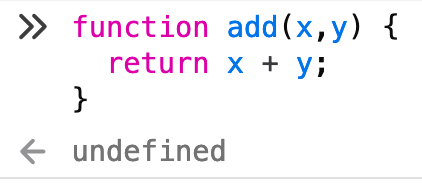
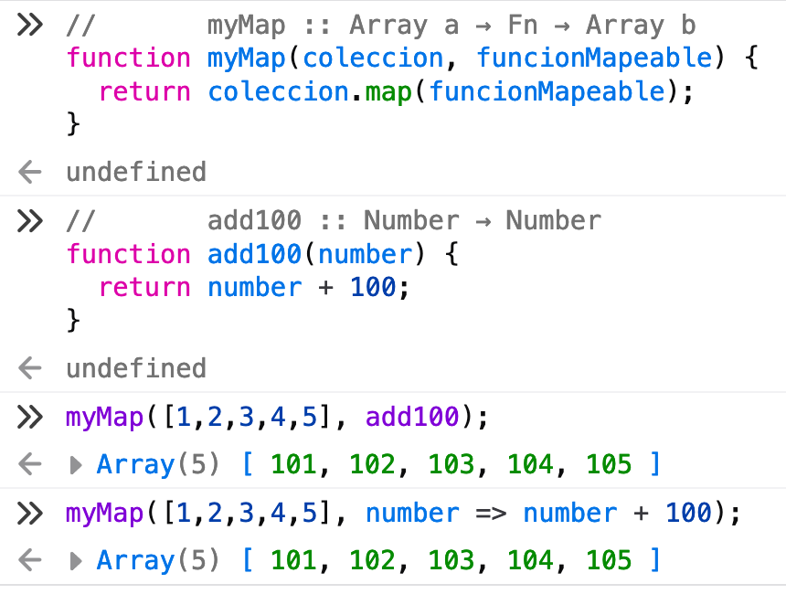
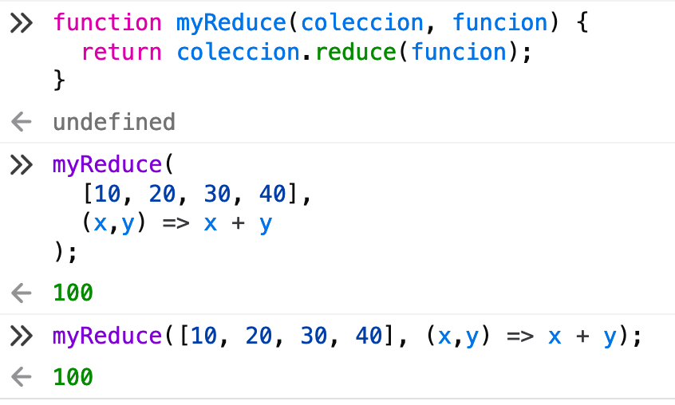

# Resumo segunda proba marzo

# Índice

- [Resumo segunda proba marzo](#resumo-segunda-proba-marzo)
- [Índice](#Índice)
  - [Bloques](#bloques)
  - [1.15 As 3 cousas que podemos facer coas funcións](#115-as-3-cousas-que-podemos-facer-coas-funcións)
    - [1.15.1 Definilas](#1151-definilas)
      - [1.15.1.1 Function definition, function declaration o function statement](#11511-function-definition-function-declaration-o-function-statement)
      - [1.15.1.2 Lambda Functions o Arrow Functions](#11512-lambda-functions-o-arrow-functions)
    - [1.15.2 Invocalas](#1152-invocalas)
      - [1.15.2.1 GOTCHA - COIDADO](#11521-gotcha---coidado)
    - [1.15.3 Usalas como valores](#1153-usalas-como-valores)
      - [1.15.3.1 Exemplo de renomeado](#11531-exemplo-de-renomeado)
      - [1.15.3.2 Exemplo de argumentos de funcións](#11532-exemplo-de-argumentos-de-funcións)
      - [1.15.3.3 Exemplo de retornado de función](#11533-exemplo-de-retornado-de-función)
      - [1.15.3.4 GOTCHA - COIDADO](#11534-gotcha---coidado)
  - [1.17 Statements vs Expressions](#117-statements-vs-expressions)
    - [1.17.1 Exercicio 1a: ⁉️ Qué devolve (`return`) a definición dunha función?](#1171-exercicio-1a-️-qué-devolve-return-a-definición-dunha-función)
    - [1.17.2 Exercicio 1b: ⁉️ Qué devolve (`return`) a definición dunha Lambda?](#1172-exercicio-1b-️-qué-devolve-return-a-definición-dunha-lambda)
    - [1.17.3 Definicións statement e expression](#1173-definicións-statement-e-expression)
    - [1.17.4 Exemplos: statements e expressions](#1174-exemplos-statements-e-expressions)
  - [1.9 Funcións anónimas, Arrow Functions e Lambda Functions](#19-funcións-anónimas-arrow-functions-e-lambda-functions)
    - [1.9.1 Inconsistencias](#191-inconsistencias)
    - [1.9.2 `return` implícito](#192-return-implícito)
  - [1.13 Notación xeral sobre tipos e funcións](#113-notación-xeral-sobre-tipos-e-funcións)
    - [1.13.1 `add1`](#1131-add1)
    - [1.13.2 `add`](#1132-add)
    - [1.13.3 `<string>.toUpperCase` e `yell`](#1133-stringtouppercase-e-yell)
    - [1.13.4 `<string>.toLowerCase` e `chillTheFunkOut`](#1134-stringtolowercase-e-chillthefunkout)
    - [1.13.5 `<array>.map(function)` e `myMap`](#1135-arraymapfunction-e-mymap)
    - [1.13.6 `<array>.filter(predicate)` e `myFilter`](#1136-arrayfilterpredicate-e-myfilter)
    - [1.13.7 `<array>.reduce(function)` e `myReduce`](#1137-arrayreducefunction-e-myreduce)
    - [1.13.8 Consideracións extra](#1138-consideracións-extra)
    - [1.13.9 Derivando unha fórmula xenérica para `myMap`](#1139-derivando-unha-fórmula-xenérica-para-mymap)
    - [1.13.10 Cal é o tipo da función `Fn` que aparece en `myMap`?](#11310-cal-é-o-tipo-da-función-fn-que-aparece-en-mymap)
  - [1.14 Exemplo de tipos visto na clase: `myMap` e `String`s](#114-exemplo-de-tipos-visto-na-clase-mymap-e-strings)
    - [1.14.1 Definición e uso de `myMap` e `add100`](#1141-definición-e-uso-de-mymap-e-add100)
    - [1.14.2 Definición e uso de `myMap` e `yell`](#1142-definición-e-uso-de-mymap-e-yell)
  - [1.12 `myMap`, `myFilter`, `myReduce`](#112-mymap-myfilter-myreduce)
    - [1.12.1 `<array>.map(function)`](#1121-arraymapfunction)
    - [1.12.2 `myMap(coleccion, funcion)`](#1122-mymapcoleccion-funcion)
    - [1.12.3 `<array>.filter(function)`](#1123-arrayfilterfunction)
    - [1.12.4 `myFilter(coleccion, predicado)`](#1124-myfiltercoleccion-predicado)
    - [1.12.5 `<array>.reduce(function)`](#1125-arrayreducefunction)
    - [1.12.6 `myReduce(coleccion, funcion)`](#1126-myreducecoleccion-funcion)
  - [Obxetos](#obxetos)

## Bloques

- As 3 cousas que podemos facer coas funcións.
- Statements vs Expressions.
- Lambda functions ou Arrow functions. Uso con `<array>.map`, `<array>.filter` e `<array>.reduce`.
- Signatura dunha función. Definición de tipos dunha función.
- Tipos e definición de funcións en:
	- `<array>.map(fn)` vs `myMap(colecccion, fn)`
	- `<array>.filter(fn)` vs `myFilter(coleccion, fn)`
	- `<array>.reduce(fn)` vs `myReduce(coleccion, fn)`
- Obxetos.

## 1.15 As 3 cousas que podemos facer coas funcións

### 1.15.1 Definilas

Xa coñecemos 2 xeitos diferentes de de definir funcións.

#### 1.15.1.1 Function definition, function declaration o function statement

O primeiro que vimos na clase 👇

```js
function add1(x) {
  return x + 1;
}
```

```js
function add(x,y) {
  return x + y;
}
```

#### 1.15.1.2 Lambda Functions o Arrow Functions

O que usamos as veces con `map`, `filter` e `reduce`

```js
(x,y) => x + y;
```

Recordade que as Lambda Functions son anónimas (non levan nome).

### 1.15.2 Invocalas

Usando

```js
<nome-da-funcion>(argumentos);
```

por exemplo

```js
add1(9);   // Devolve un 10
add1(4);   // Devolve un 5
add(4,8);  // Devolve un 12
```

#### 1.15.2.1 GOTCHA - COIDADO

👀 O uso de **`(argumentos)`** é sempre indicativo de **invocación** 👀.

### 1.15.3 Usalas como valores

En JavaScript as funcións son **VALORES** (**datos**) por si mesmas. É dicir, son valores do mesmo xeito que 👇

```js
100;
true;
"Hello";
[33, 44, 55];
```

Polo feito de ser valores, podemos

1. **Renomealas** (soese usar a expresión _"asignalas a unha variable"_).
2. **Pasalas a outras funcións como argumentos** (recordade as funcións que pasamos a `map`, `filter` e `reduce`).
3. **Ser devoltas** (`return <función>`) por outras funcións.

Ata o de agora, na clase, só fixemos o **punto 2** (pasalas a outras funcións). Nunca renomeamos unha función (**punto 1**) e nunca devolvimos unha función (**punto 2**).

#### 1.15.3.1 Exemplo de renomeado

Sen entrar na utilidade que ten esto, estamos a referirnos a 👇

```js
const suma50 = (x) => x + 50;
```



ou ben a esto 👇

```js
const suma51 = function add51(x) {
  return x + 51;
}
```



#### 1.15.3.2 Exemplo de argumentos de funcións

**Fixémolo moitas veces na clase**.

Consideremos `add1` (supoñendo que previamente a definíramos)

```js
[3,5,7,9].map(add1);
```

👆 `add1` está a ser **usada coma un valor**, do mesmo xeito que o número `5` 👇

```js
add1(5);
```

Outro xeito de facelo (**e complicalo**) é **crear e pasar como valor ao mesmo tempo**. Tamén o fixemos, pero non o explícaramos deste xeito.

```js
[3,5,7,9].map(x => x + 1);
```

Creamos a Lambda Function `x => x + 1` e inmediatemente pasámoslla a `map`.

#### 1.15.3.3 Exemplo de retornado de función

Este exemplo é para que vexades que se pode facer. Cando nos metemos a estudar as funcións podemos chegar a cousas tan enrevesadas como este exemplo. Tomádeo como un pasatempo, un crebacabezas.

```js
function giveMeAdd100() {
  return (x => x + 100);
}

giveMeAdd100();

giveMeAdd100()(30);  // 👈 WT? 😱😱😱!!!!!
```



Fixádevos no doble paréntese `()(30)` 👈 🤕🤕🤕🤕🤕 (**DOR DE MIOLOS!**)

#### 1.15.3.4 GOTCHA - COIDADO

👀 Cando usamos unha función como un valor, **NON LEVA `()`**, senón é unha invocación, que xa vimos que é diferente. Vexamos o seguinte exemplo 👇

```js
[3,5,7,9].map(add1);
```

- ☢︎🚦✋ **`add1` é usada como valor por `map`** por iso non leva `()` (non aparece como `add1(4)`).
- ☢︎🚦✋ **`map` é invocada** e leva `()` (aparece como `map(add1)`).

## 1.17 Statements vs Expressions

### 1.17.1 Exercicio 1a: ⁉️ Qué devolve (`return`) a definición dunha función?

Imos fixarnos na definición da seguinte función (**function definition**)

```js
function add(x,y) {
  return x + y;
}
```

> ⁉️ Qué devolve a definición da función (👁👁👁 non a invocación da función que devolvería a suma 👁👁👁)?

**👇 RESPOSTA 👇**

`undefined`



### 1.17.2 Exercicio 1b: ⁉️ Qué devolve (`return`) a definición dunha Lambda?

Imos definir a mesma función pero usando unha Lambda Anónima

```js
(x,y) => x + y;
```
> ⁉️ Qué devolve a definición da función Lambda (👁👁👁 non a invocación da función que devolvería a suma 👁👁👁)?

**👇 RESPOSTA 👇**

**A propia función!!!** 🤪🤪🤪👽🤖👾🤪🤪🤪


### 1.17.3 Definicións statement e expression

- Cando unha instrucción non devolve nada (é dicir retorna `undefined`) se dí que é un **statement**.
- Cando devolve algo (neste caso a propia función) se dí que é unha **expression**.

### 1.17.4 Exemplos: statements e expressions

- Unha **function definition** coa palabra `function` é un **statement**.
- A definición dunha **función lambda** coa `=>` é unha **expression**.

## 1.9 Funcións anónimas, Arrow Functions e Lambda Functions

Podemos definir **funcións anónimas** usando outra notación. Consideremos os exemplos de `map`, `filter` e `reduce` anteriores como punto de partida. O que aparece a continuación sería equivalente

```js
[10, 20, 30].map(num => num + 1);
[10, 20, 30].filter(num => num > 15);
[10, 20, 30].reduce((acc, num) => acc - num);
```

A proba


Agora resulta moito menos tedioso encadear operacións

```js
[10, 20, 30, 40, 50, 60, 70, 80]
  .map(num => num + 1)
  .filter(num => num > 15)
  .reduce((acc, num) => acc - num);
```

O resultado


### 1.9.1 Inconsistencias

As Arrow Functions teñen algunha inconsistencia ao respecto da notación

```js
// 0 parámetro
() => 27;  // ✅
   => 27;  // ❌

// 1 parámetro
(x) => x + 10; // ✅
x   => x + 10; // ✅

// 2 ou máis parámetros
(x, y, z) => x + y - z;  // ✅
x, y, z   => x + y - z;  // ❌
```

### 1.9.2 `return` implícito

As Arrow Functions levan un `return` implícito, é dicir as duas funcións que veñen a continuación son equivalentes

```js
(x, y, z) => x + y - z;
(x, y, z) => return x + y - z;
```

## 1.13 Notación xeral sobre tipos e funcións

Imos definir unha notación xeral para falar de tipos, funcións, parámetros e retorno.

### 1.13.1 `add1`

Consideremos a función `add1`

```js
function add1(x) {
  return x + 1;
}
```

Quedáramos en que `add1`:

- Recibe un só parámetro `x` i esperamos ademais que sexa un Número.
- Devolve un só valor `x + 1` que tamén esperamos que sexa un Número.

Poderiamos expresar toda esa información do seguinte xeito

```js
//       add1 :: Number → Number
function add1(x) {
  return x + 1;
}
```

### 1.13.2 `add`

Consideremos agora a función `add`

```js
function add(x, y) {
  return x + y;
}
```

Quedáramos en que `add`:

- Recibe 2 parámetros `x` e `y` i esperamos ambos sexan Números.
- Devolve un só valor `x + y` que tamén esperamos que sexa un Número.

Poderiamos expresar toda esa información do seguinte xeito

```js
//       add :: Number → Number → Number
function add(x, y) {
  return x + y;
}
```

### 1.13.3 `<string>.toUpperCase` e `yell`

Estas dúas funcións son mais interesantes xa que fan o mesmo pero veremos como a súa descrición non coincide. Comezamos por `<string>.toUpperCase`

```js
"Hello".toUpperCase();
```

`toUpperCase`:

- Recibe 0 parámetros `()`.
- Devolve un só valor que esperamos sexa un `String`.

Poderiamos expresar toda esa información do seguinte xeito

```js
//      toUpperCase :: () → String
"Hello".toUpperCase();
```

O mais complicado deste caso 👆 é percatarnos de que pese a que `toUpperCase` utiliza o `String` `"Hello"`, éste non é pasado como parámetro `()` polo que non computa na nosa descrición. Porén, arranxamos iso con `yell`

```js
function yell(text) {
  return text.toUpperCase()
}
```

`yell`:

- Recibe 1 parámetro `text` que esperamos sexa un `String`.
- Devolve un só valor que esperamos sexa outro `String`.

Polo tanto

```js
//       yell :: String → String
function yell(text) {
  return text.toUpperCase()
}
```

Comparemos a descripción de `<string>.toUpperCase` coa de `yell`

```js
toUpperCase :: ()     → String
       yell :: String → String
```

Pese a que fan o mesmo, a descrición é diferente.

### 1.13.4 `<string>.toLowerCase` e `chillTheFunkOut`

O mesmo caso de antes, 2 funcións que fan o mesmo e teñen descricións diferentes.

```js
//      toLowerCase :: () → String
"HELLO".toLowerCase();

//       chillTheFunkOut :: String → String
function chillTheFunkOut(text) {
  return text.toLowerCase();
}
```

Comparemos as descricións de `<string>.toUpperCase`, `yell`, `<string>.toLowerCase` e `chillTheFunkOut`

```js
    toUpperCase :: ()     → String
           yell :: String → String
    toLowerCase :: ()     → String
chillTheFunkOut :: String → String
```

### 1.13.5 `<array>.map(function)` e `myMap`

Algo parecido acontece tamén con `<array>.map(function)` e `myMap`. Fan o mesmo pero teñen descricións diferentes. Imos usar `Fn` para simbolizar `Function`.

```js
//               map :: Fn → Array Number
[10, 20, 30, 40].map(x => x + 1);

//       myMap :: Array Number → Fn → Array Number
function myMap(coleccion, funcion) {
  return coleccion.map(funcion);
}
```

Comparemos as descricións de ambas

```js
  map ::                Fn → Array Number
myMap :: Array Number → Fn → Array Number
```

### 1.13.6 `<array>.filter(predicate)` e `myFilter`

O mesmo caso que con `map` e `myMap`

```js
//               filter :: Fn → Array Number
[10, 20, 30, 40].filter(x => x > 15);

//       myFilter :: Array Number → Fn → Array Number
function myFilter(coleccion, predicado) {
  return coleccion.filter(predicado);
}
```

Recordade que un `predicate` (predicado) é unha función (o que acontece é que é unha función que retorna un booleano: `true` ou `false`).

```js
  filter ::                Fn → Array Number
myFilter :: Array Number → Fn → Array Number
```

### 1.13.7 `<array>.reduce(function)` e `myReduce`

O mesmo caso de `map` e `myMap` e de `filter` e `myFilter`

```js
//               reduce :: Fn → Number
[10, 20, 30, 40].reduce((x,y) => x + y);

//       myReduce :: Array Number → Fn → Number
function myReduce(coleccion, funcion) {
  return coleccion.reduce(funcion);
}
```

Agora as descricións comparadas

```js
  reduce ::                Fn → Number
myReduce :: Array Number → Fn → Number
```

Novamente, 2 funcións que fan o mesmo teñen descricións diferentes.

### 1.13.8 Consideracións extra

1. A descrición de funcións mediante os tipos **non consideran un efecto secundario como unha saída!**.
2. Cando usamos a notación `<algo>.funcion(...)`, `algo` non conta como entrada.

### 1.13.9 Derivando unha fórmula xenérica para `myMap`

Recordemos `myMap`

```js
function myMap(coleccion, funcion) {
  return coleccion.map(funcion);
}
```

`myMap` pode ter todas estas descricións (pode incluso ter máis)

```js
myMap :: Array Number → Fn → Array String
myMap :: Array Number → Fn → Array Number
myMap :: Array String → Fn → Array String
myMap :: Array String → Fn → Array Number
```

É certo que todavía no vimos exemplos de función coa seguinte forma ou descrición

```js
nonVista1 :: Number → String
nonVista2 :: String → Number
```

pero existen.

> Qué é o que cambia nas descricións de `myMap`?

`String` e `Number`

> Podemos facer ainda máis xenérica a descrición de `myMap`?

Sí que podemos. Do mesmo xeito que é costume usar `x` e `y` como nomes dos parametros das funcións que como `add` reciben 2 números. Recordemos 👇

```js
function add(x, y) {
  return x + y;
}
```

É costume usar `a` e `b` do mesmo xeito na descrición de funcións. É dicir 👇

```js
myMap :: Array a → Fn → Array b
```

E ao igual que `x` e `y` poden valer calquera número

```
add(3,5);
add(9,14);
```

`a` e `b` poden ser calquera tipo

```js
myMap :: Array a → Fn → Array b

// a: Number, b: Number
myMap :: Array Number → Fn → Array Number

// a: String, b: String
myMap :: Array String → Fn → Array String

// a: Number, b: String
myMap :: Array Number → Fn → Array String

// a: String, b: Number
myMap :: Array String → Fn → Array Number
```

Agora todas xuntas

```js
myMap :: Array a      → Fn → Array b
myMap :: Array Number → Fn → Array Number
myMap :: Array String → Fn → Array String
myMap :: Array Number → Fn → Array String
myMap :: Array String → Fn → Array Number
```

### 1.13.10 Cal é o tipo da función `Fn` que aparece en `myMap`?

Vexamos uns cantos exemplos de funcións que sabemos que funcionan con `map` e tamén con `myMap`

```js
//       add1 :: Number → Number
function add1(x) {
  return x + 1;
}

//       yell :: String → String
function yell(text) {
  return text.toUpperCase();
}
```

É dicir

```js
add1 :: Number → Number
yell :: String → String
```

Parece que teñen a forma

```js
xxxx :: a → a
```

Todas xuntas

```js
xxxx :: a      → a
add1 :: Number → Number
yell :: String → String
```

**NOTA**: Na clase do mércores 19 veremos polo menos un exemplo de funcións que teñan a seguinte forma

```js
xxx1 :: String → Number
xxx2 :: Number → String
```

A forma das funcións `Fn` que admite `map` e polo tanto `myMap` é

```js
mapeable :: a → b
```

## 1.14 Exemplo de tipos visto na clase: `myMap` e `String`s

### 1.14.1 Definición e uso de `myMap` e `add100`

```js
//       myMap :: Array a → Fn → Array b
function myMap(coleccion, funcionMapeable) {
  return coleccion.map(funcionMapeable);
}

//       add100 :: Number → Number
function add100(number) {
  return number + 100;
}

myMap([1,2,3,4,5], add100);

myMap([1,2,3,4,5], number => number + 100);
```

Resultado de executalo na consola do Firefox 👇



### 1.14.2 Definición e uso de `myMap` e `yell`

```js
//       myMap :: Array a → Fn → Array b
function myMap(coleccion, funcionMapeable) {
  return coleccion.map(funcionMapeable);
}

//       yell :: String → String
function yell(texto) {
  return texto.toUpperCase();  // 👈👀 recordade o return
}

myMap(["ola", "hello", "hallo", "hola"], yell);

myMap(["ola", "hello", "hallo", "hola"], texto => texto.toUpperCase());
```

Resultado de executalo na consola do Firefox 👇


## 1.12 `myMap`, `myFilter`, `myReduce`

### 1.12.1 `<array>.map(function)`

Recordemos como funcionaba `map`

```js
[10, 20, 30, 40].map(x => x + 1);
```

É dicir

```
      -------
      |     |
 fn → | map | → colección
      |     |
      -------
```

Pero `map` fai trampas porque usa unha colección extra. No exemplo de arriba `[10, 20, 30, 40]`.

### 1.12.2 `myMap(coleccion, funcion)`

Queremos facer unha función `myMap` que siga a seguinte descripción

```
               ---------
  coleccion1 → |       |
               | myMap | → coleccion2
          fn → |       |
               ---------
```

e que internamente use `<array>.map(function)`.

```js
function myMap(coleccion, funcion) {
  return coleccion.map(funcion);
}

myMap(
  [10, 20, 30, 40],
  x => x + 1
);
```

Comprobamos


### 1.12.3 `<array>.filter(function)`

Recordemos como funcionaba `filter`

```js
[10, 20, 30, 40].filter(x => x > 15);
```

É dicir

```
      ----------
      |        |
 fn → | filter | → colección
      |        |
      ----------
```

Pero `filter` fai trampas (as mesmas trampas que `map`) porque usa unha colección extra. No exemplo de arriba `[10, 20, 30, 40]`.

### 1.12.4 `myFilter(coleccion, predicado)`

Queremos facer unha función `myFilter` que siga a seguinte descripción

```
               ------------
  coleccion1 → |          |
               | myFilter | → coleccion2
   predicado → |          |
               ------------
```

e que internamente use `<array>.filter(function)`.

```js
function myFilter(coleccion, predicado) {
  return coleccion.filter(predicado);
}

myFilter(
  [10, 20, 30, 40],
  x => x > 15
);
```

Comprobamos


### 1.12.5 `<array>.reduce(function)`

Recordemos como funcionaba `reduce`

```js
[10, 20, 30, 40].reduce((x,y) => x + y);
```

É dicir

```
      ----------
      |        |
 fn → | reduce | → valor
      |        |
      ----------
```

Pero `reduce` fai trampas porque usa unha colección extra. No exemplo de arriba `[10, 20, 30, 40]`.

### 1.12.6 `myReduce(coleccion, funcion)`

Queremos facer unha función `myReduce` que siga a seguinte descripción

```
               ------------
  coleccion1 → |          |
               | myReduce | → valor
          fn → |          |
               ------------
```

e que internamente use `<array>.reduce(function)`.

```js
function myReduce(coleccion, funcion) {
  return coleccion.reduce(funcion);
}

myReduce(
  [10, 20, 30, 40],
  (x,y) => x + y
);
```

Comprobamos



## Obxetos

- [Codepen co exemplo da calculadora](https://codepen.io/davidgchaves/pen/OJVpKjx)
- [Kraftwerk en directo no 2005](https://www.youtube.com/watch?v=WvIRsDHFiis)
- [Kraftwerk orixinal de 1981](https://www.youtube.com/watch?v=eSBybJGZoCU)
